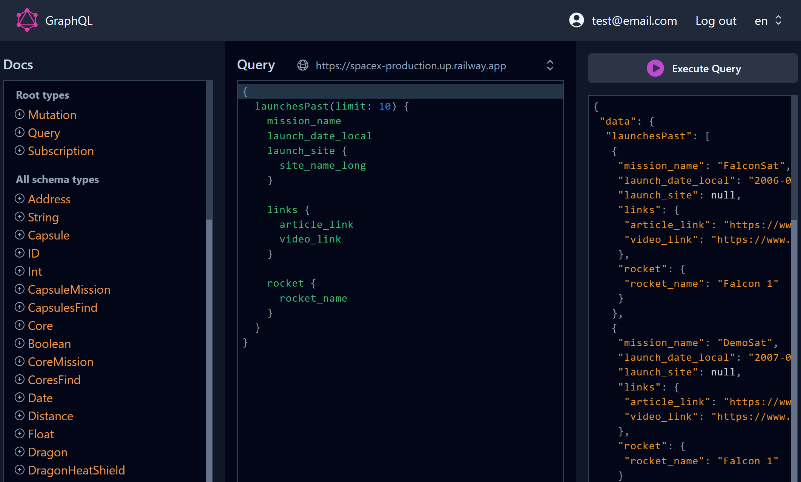

# GraphiQL App



**GraphiQL App** is a web-based development tool for testing and exploring **GraphQL APIs**. It provides an interactive interface where developers can write and execute **GraphQL queries**, view the response data, and explore the **API documentation**. GraphiQL allows users to set **query variables and headers**, making it easy to test various scenarios and edge cases. It also offers features like **syntax highlighting**, which make writing GraphQL queries more efficient. Overall, GraphiQL is a powerful and user-friendly tool for testing and developing GraphQL APIs.

App is deployed on **Vercel**, a powerful cloud platform for hosting web applications. With Vercel's serverless architecture and seamless integration with **Git**, we benefit from reliable and efficient deployment processes. Experience our app with the speed, scalability, and security offered by Vercel's cutting-edge infrastructure.

Production link: [GraphiQL App](https://graphiql-app.vercel.app/)

## Features

- Interactive interface for writing and executing GraphQL queries
- View and analyze response data
- Explore API documentation
- Set query variables and headers for testing scenarios
- Syntax highlighting for efficient query writing

## Getting Started

To get started with GraphiQL App, you can either select from a list of available GraphQL APIs or input your own API link.

### Installation

1. Clone the repository:

```bash
git clone https://github.com/elquespera/graphiql-app.git
```

2. Install the dependencies:

```bash
cd graphiql-app
npm install
```

3. Add the following keys for firebase auth to work in `.env.local` file:

```env
NEXT_PUBLIC_FIREBASE_API_KEY=
NEXT_PUBLIC_FIREBASE_AUTH_DOMAIN=
NEXT_PUBLIC_FIREBASE_PROJECT_ID=
NEXT_PUBLIC_FIREBASE_STORAGE_BUCKET=
NEXT_PUBLIC_FIREBASE_MESSAGING_SENDER_ID=
NEXT_PUBLIC_FIREBASE_APP_ID=
```

### Usage

1. Start the development server:

```bash
npm run dev
```

2. Open your browser and navigate to `http://localhost:3000` to access the app.

## Dependencies

- **[@codemirror/lang-javascript](https://www.npmjs.com/package/@codemirror/lang-javascript):** JavaScript language support for CodeMirror text editor.

- **[@headlessui/react](https://www.npmjs.com/package/@headlessui/react):** Collection of fully accessible UI components for React.

- **[@heroicons/react](https://www.npmjs.com/package/@heroicons/react):** Free SVG icons optimized for React.

- **[@lezer/highlight](https://www.npmjs.com/package/@lezer/highlight):** Syntax highlighting for CodeMirror editor.

- **[@reduxjs/toolkit](https://www.npmjs.com/package/@reduxjs/toolkit):** Utilities and abstractions for efficient Redux state management.

- **[@uiw/codemirror-themes](https://www.npmjs.com/package/@uiw/codemirror-themes):** Collection of themes for customizing CodeMirror appearance.

- **[@uiw/react-codemirror](https://www.npmjs.com/package/@uiw/react-codemirror):** React wrapper for CodeMirror text editor.

- **[axios](https://www.npmjs.com/package/axios):** Promise-based HTTP client for API requests.

- **[clsx](https://www.npmjs.com/package/clsx):** JavaScript library for constructing conditional CSS class names.

- **[firebase](https://www.npmjs.com/package/firebase):** Integration of Firebase services like authentication and database.

- **[next](https://www.npmjs.com/package/next):** Framework for server-side rendering and routing in React.

- **[next-redux-cookie-wrapper](https://www.npmjs.com/package/next-redux-cookie-wrapper):** Redux wrapper for Next.js with cookie persistence.

- **[next-redux-wrapper](https://www.npmjs.com/package/next-redux-wrapper):** Simplifies Redux integration in Next.js applications.

- **[react](https://www.npmjs.com/package/react):** JavaScript library for building user interfaces.

- **[react-dom](https://www.npmjs.com/package/react-dom):** DOM-specific methods for rendering React components.

- **[react-firebase-hooks](https://www.npmjs.com/package/react-firebase-hooks):** Collection of React hooks for Firebase integration.

- **[react-hook-form](https://www.npmjs.com/package/react-hook-form):** Library for building performant and flexible forms in React.

- **[react-redux](https://www.npmjs.com/package/react-redux):** Official Redux bindings for React.

- **[swr](https://www.npmjs.com/package/swr):** Library for efficient data fetching and caching in React applications.
